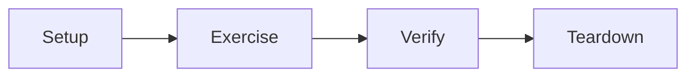

# 0. 概述

本文在测试中主要使用 `JUnit4`，结合 `Mockito` 和 `Hamcrest`，对 `Controller` 层的测试结合 `Spring MVC Testing`。所有的内容均是结合 `Spring` 和 `JUnit4` 的实践。参考[程序](http://192.168.1.223/jingyang1/TestDemo)。

# 1. 四阶段测试



* Setup 设置：设置环境和依赖。
* Exercise 执行：执行要测试的元素。
* Verify 验证：验证预期。
* Teardown 拆卸：回收资源、删除测试数据。

一个典型的四阶段测试：
```java
public class TypicalTest extends TestCase {
    private List<Integer> list2Verify = new ArrayList<>();

    // setup
    public void setUp() {
        list2Verify.add(1);
    }

    public void testExercise() {
        // exercise
        int i = list2Verify.get(0);

        // verify
        assertEquals(i, 1);
    }

    // teardown
    public void tearDown() {
        list2Verify = null;
    }
}
```

# 2. 测试框架

## 2.1 JUnit4

### 注意事项
* 测试类以 `Test` 结尾；
* 方法要有 `@Test` 注解；
* 方法必须是 `public`，并以 `test` 开头，返回值为 `void`。

上述命名规则在 `JUnit4` 中并非强制要求，但是如果不这样命名在使用 `SonarQube` 等代码质量检测软件时会得不到单元测试覆盖率。

### 对应四阶段测试可用的工具

#### Setup
* `@Before`：在每个测试方法执行之前都会执行一次的方法。
* `@BeforeClass` ：在所有测试方法执行之前**只会执行一次**的方法，方法必须是 `static`的。

```java
public class TestFixturesExample {
  private ManagedResource myManagedResource;
  private static ExpensiveManagedResource myExpensiveManagedResource;
  
  @BeforeClass
  public static void setUpClass() {
    System.out.println("@BeforeClass setUpClass");
    myExpensiveManagedResource = new ExpensiveManagedResource();
  }

  @Before
  public void setUp() {
    this.println("@Before setUp");
    this.myManagedResource = new ManagedResource();
  }
    
  // test methods...
}
```

#### Exercise
* `@Test`：每个测试类必须有的注解。
* `@Ignore`：忽略测试方法。

#### Verify
* `org.junit.Assert.*`：静态断言方法。

```java
public class AssertTests {
  @Test
  public void testAssertEquals() {
    assertEquals("failure - strings are not equal", "text", "text");
  }

  @Test
  public void testAssertFalse() {
    assertFalse("failure - should be false", false);
  }

  @Test
  public void testAssertNotNull() {
    assertNotNull("should not be null", new Object());
  }

  @Test
  public void testAssertNotSame() {
    assertNotSame("should not be same Object", new Object(), new Object());
  }
  
  // more...
}
```

* @Test(excepted)：异常测试。

```java
@Test(expected = IndexOutOfBoundsException.class) 
public void empty() { 
     new ArrayList<Object>().get(0); 
}
```

#### Teardown
* `@After`：在**每个**测试方法之后都会**执行一次**的方法。
* `@AfterClass`：在所有测试方法执行之后**只会执行一次**的方法，方法必须是 `static`的。

```java
public class TestFixturesExample {
  private ManagedResource myManagedResource;
  private static ExpensiveManagedResource myExpensiveManagedResource;
  
  // test methods...

  @After
  public void tearDown() throws IOException {
    this.println("@After tearDown");
    this.myManagedResource.close();
    this.myManagedResource = null;
  }
    
  @AfterClass
  public static void tearDownClass() throws IOException {
    System.out.println("@AfterClass tearDownClass");
    myExpensiveManagedResource.close();
    myExpensiveManagedResource = null;
  }
}
```

## 2.2 Mockito
`Mokito` 是一个 Mock 框架，可以和 `JUnit4` 结合使用。

### 什么是 mock
Mock的意思是模拟，在软件测试中就是通过某种手段模拟被测试对象的行为，根据测试场景返回`预先设计`的结果。

### 为什么要 mock
Mock 可以解除测试对象对外部服务的依赖（如数据库，第三方接口等），使测试用例可以独立运行。

```java
public class MockTest {
    @Mock
    private UserMapper userMapper;

    @Test
    public void testSelect() {
        UserEntity entity = new UserEntity();
        entity.setId(1);
        entity.setName("abc");
        // Mock 的 userMapper 查询 id 为1的 UserEntity 时，返回预设的对象，解除了对数据库依赖
        when(userMapper.selectEntity(1)).thenReturn(entity);
        UserEntity entity1 = userMapper.selectEntity(1);
        // other operations...
    }
}
```

### 使用方法

#### 模拟（Mock）对象

* `org.mockito.Mockito.mock`：创建 mock 对象。

```java
import static org.mockito.Mockito.*;
List mockedList = mock(List.class);
```

* `@Mock`：属性注解，创建 mock 对象。

```java
public class ArticleManagerTest {
    @Mock 
    private ArticleCalculator calculator;
}
```

* `@InjectMocks`

```java
public class ArticleManager {
    ArticleManager(ArticleCalculator calculator, ArticleDatabase database) {
        // parameterized constructor
    }
}

public class ArticleManagerTest {
    @Mock
    private ArticleCalculator calculator;
    
    @Mock(name = "database") 
    private ArticleDatabase dbMock;
    
    @InjectMocks // 注入 mock 对象
    private ArticleManager manager;

    @Test public void shouldDoSomething() {
        manager.initiateArticle();
        // other operations...
    }
}
```

#### 设计预期

* `org.mockito.Mockito.when`：设置 mock 对象要执行的方法。
* `org.mockito.stubbing.*`：返回预期值（`thenReturn`）、返回异常（`thenThrow`）、调用真实方法（`thenCallRealMethod`）等。
* `org.mockito.stubbing.*`：返回预期值（`doReturn`）、返回异常（`doThrow`）、调用真实方法（`doCallRealMethod`）等。
```java
public class MockTest {
    @Test
    public void testThenReturn() {
        List list = mock(List.class);
        when(list.get(0)).thenReturn("test string");
        assertEquals(list.get(0), "test string");
    }

    @Test(expected = ArrayIndexOutOfBoundsException.class)
    public void testThenThrow() {
        List list = mock(List.class);
        // 原本应该抛出 IndexOutOfBoundsException
        when(list.get(0)).thenThrow(ArrayIndexOutOfBoundsException.class);
        list.get(0);
    }

    @Test
    public void testCallRealMethod() {
        UserEntity entity = mock(UserEntity.class);
        when(entity.getName()).thenCallRealMethod();
        entity.getName();
    }
}
```

### 执行验证

验证测试结果时，可以结合 `Hamcrest` 和 `JUnit4` 。

* `org.mockito.Mockito.verify`：检验特定行为。
* `org.mockito.ArgumentMatchers.*`：参数匹配器。
* 验证方法调用次数：`org.mockito.Mockito.times`等。

```java
@Test
public void testVerify() {
    List list = mock(List.class);
    list.add("String");
    list.get(0);
    list.get(0);
    list.get(0);
    verify(list).add(anyString()); // 检验 list 放入了一个 String 类型元素
    verify(list, times(3)).get(anyInt()); // 检验 list 获取了3次元素
}
```

## 2.3 Hamcrest

`Hamcrest`是一个用于编写匹配器对象的框架，可以与不同的单元测试框架集成。

```java
public class HamcrestTest {
    private List<Integer> list = new ArrayList<>(3);
    private Map<String, Integer> map = new HashMap<>();
    String[] strArray = {"1", "2"};

    @Before
    public void setUp() {
        list.add(1);
        list.add(2);
        map.put("1", 1);
        map.put("2", 2);
        map.put("3", 3);
    }

    @Test
    public void test() throws Exception {
        assertThat(1, is(1));
        assertThat(1, equalTo(1));
        assertThat(new Object(), instanceOf(Object.class));
        assertThat(null, nullValue());
        assertThat(new Object(), notNullValue());

        assertThat(map, Matchers.hasEntry("1", 1));
        assertThat(map, Matchers.hasKey("2"));
        assertThat(map, Matchers.hasValue(3));

        assertThat(list, Matchers.hasItem(1));
        assertThat(list, Matchers.hasItems(1, 2));
        assertThat(strArray, hasItemInArray("1"));

        assertThat("JY", containsString("J"));
        assertThat("JY", startsWith("J"));
        assertThat("JY", endsWith("Y"));

        assertThat("JY", allOf(startsWith("J"), endsWith("Y")));
        assertThat("JY", anyOf(startsWith("J"), endsWith("Y")));
    }
}
```

## 2.4 Spring MVC Testing

`Spring MVC Testing` 使用流畅的 API 测试 `Spring MVC` 代码，可以与 `JUnit4` 结合使用，使用非常简单。

* `org.springframework.test.web.servlet.MockMvc`：测试的入口。
* `org.springframework.test.web.servlet.request.MockMvcRequestBuilders.*`：提供 HTTP 请求方法、参数等。
* `org.springframework.test.web.servlet.result.MockMvcResultHandlers.*`：对测试执行结果的处理。
* `org.springframework.test.web.servlet.result.MockMvcResultMatchers.*`：测试结果匹配。

```java
public class ControllerTest {

    @Resource
    private WebApplicationContext wac;

    private MockMvc mockMvc;

    private static ObjectMapper mapper;

    @BeforeClass
    public static void init() {
        mapper = new ObjectMapper();
    }

    @Before
    public void setup() {
        mockMvc = MockMvcBuilders.webAppContextSetup(this.wac).build();
    }

    /**
     * get 方法.
     *
     * @throws Exception
     */
    @Test
    public void testSelect() throws Exception {
        mockMvc.perform(get("/user/select")
                .param("id", "1")) // request 参数
                .andDo(print())
                .andExpect(content().contentType(MediaType.APPLICATION_JSON_UTF8_VALUE))
                .andExpect(status().is(200));
    }

    /**
     * post 方法.
     *
     * @throws Exception
     */
    @Test
    public void testInsert() throws Exception {
        UserDTO dto = new UserDTO();
        dto.setName("fff");

        mockMvc.perform(post("/user/insert")
                .content(mapper.writeValueAsBytes(dto))
                .contentType(MediaType.APPLICATION_JSON))
                .andDo(print())
                .andExpect(status().isOk());
    }

    /**
     * patch 方法.
     *
     * @throws Exception
     */
    @Test
    public void testUpdate() throws Exception {
        UserDTO dto = new UserDTO();
        dto.setId(1);
        dto.setName("bbb");

        mockMvc.perform(patch("/user/update")
                .content(mapper.writeValueAsBytes(dto)) // body
                .contentType(MediaType.APPLICATION_JSON)) // content-type
                .andDo(print())
                .andExpect(status().isOk());
    }

    /**
     * 异常.
     *
     * @throws Exception
     */
    @Test
    public void test404() throws Exception {
        mockMvc.perform(get("/user/notfound"))
                .andExpect(status().is(404));
    }
}
```

# 3. 实践

## 3.1 Controller 层测试
参照 <u>2.4 Spring MVC Testing</u>。

## 3.2 DAO 层测试

参照 <u>2.2 Mockito</u>。

## 3.3 数据库有关测试

最终有很多单元测试（或者集成测试）无法避免使用数据库，为了减少配置，避免不同开发者之间互相干扰，必须要控制对数据库的使用。

### 3.3.1 回滚数据

* `@Transaction`：保证测试类的数据库操作可以回滚，这种最简单。
* 使用 `@BeforeClass`、`@AfterClass` 等方法，在测试前插入数据，在测试完成后删除数据，保证测试前后数据库状态一致。

### 3.3.2 使用内存数据库
使用内存数据库可以保证每个开发者互不干扰，提高工作效率。以下选用的是 `H2` 数据库。

* 引入测试使用的内存数据库：

```xml
<dependency>
    <groupId>com.h2database</groupId>
    <artifactId>h2</artifactId>
    <scope>test</scope>
</dependency>
```

* 编写数据库相关测试父类：

```java
@RunWith(SpringRunner.class)
@SpringBootTest(webEnvironment = SpringBootTest.WebEnvironment.RANDOM_PORT) // 内存数据库端口
@AutoConfigureTestDatabase(connection = EmbeddedDatabaseConnection.H2) // 内存数据库使用 H2
public class InMemoryDBTest {
	// 测试方法
}
```

* 代码结构：表结构统一放入 `schema.sql`，数据放入 `data.sql`，测试启动时内存数据库会自动加载文件内容。
```
project
	-src
		-main
		-test
			-java
			-resource
				-application-test.properties
				-data.sql
				-schema.sql
	-pom.xml
```

测试开始时，内存数据库就建立了，数据会全部加载到内存；测试结束时，内存数据库也随之销毁。开发时每个开发者的数据也不会相互干扰，在统一测试之前只要把所有要用的数据放入 `data.sql` 就行了。

# 4. 单元测试效果

## 本地查看

Idea 可以查看测试覆盖率：


## SonarQube

`SonarQube` 是代码质量检查的专业工具，可以单独部署或者作为 `Jenkins` 的插件安装。本文对此不做讨论。

# 5. 参考

[Four-Phase Test](http://xunitpatterns.com/Four%20Phase%20Test.html)

[Mocks Aren't Stubs](https://martinfowler.com/articles/mocksArentStubs.html)

[JUnit4](https://junit.org/junit4/)

[Mockito](https://site.mockito.org/)

[Mockito框架中文文档](https://github.com/hehonghui/mockito-doc-zh)

[Hamcrest](http://hamcrest.org/JavaHamcrest/tutorial)

[Spring Testing](https://docs.spring.io/spring/docs/current/spring-framework-reference/testing.html#testing-introduction)

[DbUnit](http://dbunit.sourceforge.net/)

[H2](http://www.h2database.com/html/main.html)

[Don't use In-Memory Databases (H2, Fongo) for Tests](https://blog.philipphauer.de/dont-use-in-memory-databases-tests-h2/)

[面向开发的测试技术（一）：Mock](http://emacoo.cn/arch/test-mock/)

[关于数据库单元测试](http://jxy.me/2016/05/06/db-unit-test/)
